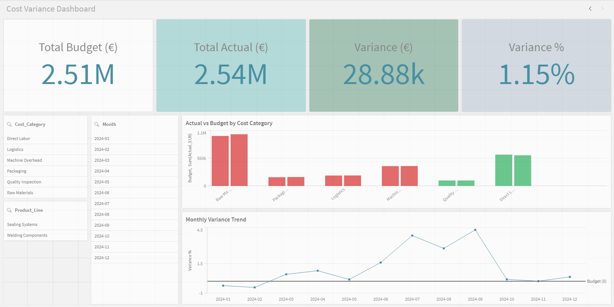
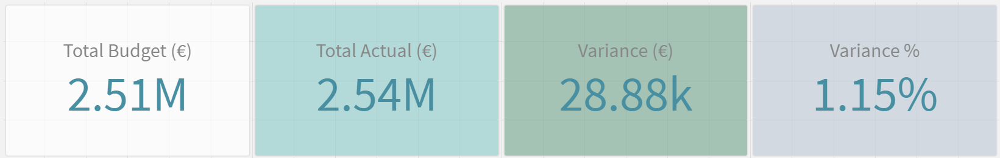
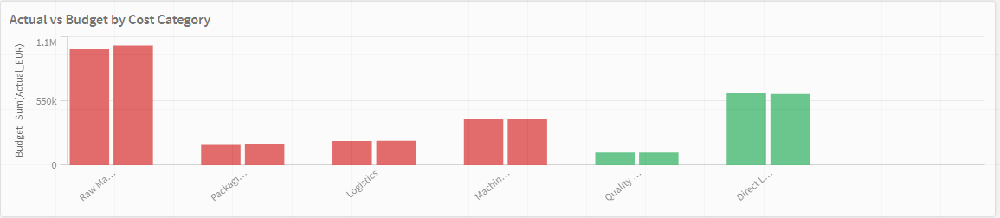
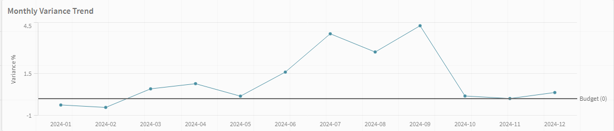
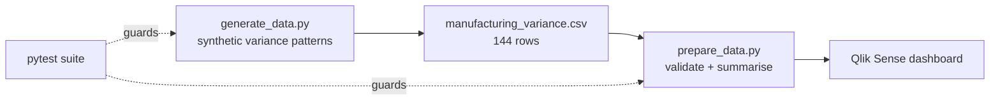

# Manufacturing Cost Variance Analysis
**A Qlik Sense Case Study**

[](tests/) [](scripts/) [](qlik/Manufacturing_Cost_Variance.qvf) [](LICENSE)

Dashboard built on synthetic manufacturing cost data. 12 months, 6 cost categories, 2 product lines — budget vs. actual, designed to give a controller a one-click answer instead of a 20-minute Excel rebuild.

<p align="center">
  
</p>

---

## Table of contents

- [The problem](#the-problem)
- [Dashboard design](#dashboard-design)
- [Dataset](#dataset)
- [What the numbers show](#what-the-numbers-show)
- [How to run](#how-to-run)
- [Tests](#tests)
- [Repository structure](#repository-structure)
- [With real data](#with-real-data)
- [Stack](#stack)

---

## The problem

Monthly variance reporting in manufacturing controlling usually lives in Excel: budget vs. actual, manually color-coded, pasted into a slide for the month-end meeting. When a manager asks "which cost center is running hot this quarter?" finding the answer takes longer than it should.

This dashboard gives that answer in seconds — by category, by product line, by month — with a click instead of a pivot table.

---

## Dashboard design

One screen. Three components, built in [Qlik Sense](qlik/Manufacturing_Cost_Variance.qvf) on top of [`manufacturing_variance.csv`](data/manufacturing_variance.csv). A static export lives at [`dashboard/Manufacturing_Cost_Variance_Dashboard.pdf`](dashboard/Manufacturing_Cost_Variance_Dashboard.pdf) for anyone without Qlik installed.

### KPI strip (top row)

Total Budget, Total Actual, Variance €, and Variance % — color-coded green/red. All four update instantly when any filter is applied.

<p align="center">
  
</p>

### Bar chart — actual vs. budget by cost category

Side-by-side bars. The gap is visible without reading numbers. Red bars run over budget, green bars run under. Clicking any bar cross-filters the trend line below it via Qlik's associative model.

<p align="center">
  
</p>

### Line chart — monthly variance % trend

Shows whether a category is improving or getting worse over time. Raw Materials peaks in Q3 and comes back down — that's the story this dashboard tells.

<p align="center">
  
</p>

### Filter pane (left side)

Product Line, Cost Category, Month — visible in the [full dashboard view](dashboard/screenshots/full_dashboard.png) above.

One screen by design. A second drill-down sheet would be the natural next step with real data, but for a demo it adds surface area without adding insight.

---

## Architecture



- **Generate** — reproducible synthetic cost data with realistic, non-random variance patterns.
- **Prepare** — validation plus a terminal summary that mirrors the dashboard totals.
- **Visualise** — a single-screen Qlik Sense sheet; swap the CSV for an SAP/ERP export to go live.
- **Tests** — a `pytest` suite guards both the generator and the prep step.

## Dataset

[`data/manufacturing_variance.csv`](data/manufacturing_variance.csv) — 144 rows, generated by [`scripts/generate_data.py`](scripts/generate_data.py). Column-level definitions live in [`docs/data_dictionary.md`](docs/data_dictionary.md).

| Column | Type | Description |
|---|---|---|
| `Month` | `YYYY-MM` | Reporting month |
| `Product_Line` | String | Sealing Systems / Welding Components |
| `Cost_Category` | String | Raw Materials, Direct Labor, Machine Overhead, Packaging, Quality Inspection, Logistics |
| `Budget_EUR` | Float | Monthly planned cost in EUR |
| `Actual_EUR` | Float | Actual spend in EUR |
| `Variance_EUR` | Float | Actual minus Budget |
| `Variance_Pct` | Float | Variance as % of Budget |
| `Over_Budget` | Yes/No | Filter flag for conditional coloring |

**Built-in variance patterns (realistic, not random noise):**

| Category | Pattern | Period |
|---|---|---|
| Raw Materials | +8 to +14% over budget | July – September |
| Direct Labor | −3 to −8% under budget | July – December |
| Packaging | ~0.5% monthly cost creep | Full year |
| Logistics | +5 to +11% over budget | October – December |
| Machine Overhead | Flat ±3% | Full year |
| Quality Inspection | Flat ±5% | Full year |

Full year result: **+1.2% over total budget** (€2,536,879 actual vs. €2,508,000 budget).

---

## What the numbers show

```
Category               Budget (€)   Actual (€)    Var %
----------------------------------------------------------
Direct Labor              624,000      610,644  ▼2.1%
Logistics                 207,600      210,621  ▲1.5%
Machine Overhead          396,000      397,354  ▲0.3%
Packaging                 174,000      178,667  ▲2.7%
Quality Inspection        110,400      110,318  ▼0.1%
Raw Materials             996,000    1,029,275  ▲3.3%
----------------------------------------------------------
TOTAL                   2,508,000    2,536,879  ▲1.2%
```

This is the live output of [`scripts/prepare_data.py`](scripts/prepare_data.py) — run it yourself and the numbers above are exactly what prints to your terminal.

Raw Materials is the main story: 3.3% over for the year, concentrated in Q3. Direct Labor savings (2.1% under) offset roughly half of that. Packaging at 2.7% is the slow-burn problem — small monthly gaps that compound.

---

## How to run

```bash
# Regenerate the dataset
python scripts/generate_data.py

# Validate + print summary
python scripts/prepare_data.py
```

No pip dependencies for the pipeline itself. Python 3.10+ with stdlib only.

**To open the dashboard:** load [`Manufacturing_Cost_Variance.qvf`](qlik/Manufacturing_Cost_Variance.qvf) directly in Qlik Sense Desktop (free trial at [qlik.com](https://www.qlik.com/us/trial)), or open the `.qvf` and point it at [`data/manufacturing_variance.csv`](data/manufacturing_variance.csv) if rebuilding the data model from scratch.

> **Note:** `.qvf` is excluded by [`.gitignore`](.gitignore) for typical Qlik projects, since it's a large binary that isn't human-diffable. It's included here anyway since the goal is a working, downloadable demo — when adapting this repo for production, evaluate whether your `.qvf` should be tracked or distributed separately (e.g. via a release asset).

---

## Tests

[`scripts/generate_data.py`](scripts/generate_data.py) and [`scripts/prepare_data.py`](scripts/prepare_data.py) are covered by a 33-test pytest suite in [`tests/`](tests/), verified locally:

```bash
pip install pytest --break-system-packages   # one-time
pytest tests/ -v
```

```
33 passed in 0.09s
```

What's covered:

| Test file | What it checks |
|---|---|
| [`tests/test_generate_data.py`](tests/test_generate_data.py) | Budget table integrity, the four seasonal variance patterns (Raw Materials Q3 spike, Direct Labor H2 efficiency, Packaging creep, Logistics Q4 spike), row-count math, internal consistency of `Variance_EUR`/`Variance_Pct`/`Over_Budget`, determinism under a fixed random seed, and CSV file output |
| [`tests/test_prepare_data.py`](tests/test_prepare_data.py) | CSV loading, schema validation (missing columns, empty cells, correct error row numbers), category/product-line/month counting, summary totals and ▲/▼ direction logic, and a full end-to-end run against a freshly generated CSV |

The checked-in [`data/manufacturing_variance.csv`](data/manufacturing_variance.csv) was confirmed byte-for-byte reproducible from `generate_data.py` (seeded with `random.seed(42)`) — there's no drift between the script and the shipped data.

---

## Repository structure

```
manufacturing-cost-variance-qlik/
├── README.md                                    ← you are here
├── LICENSE                                       MIT
├── .gitignore
│
├── data/
│   └── manufacturing_variance.csv                144-row dataset (output of generate_data.py)
│
├── scripts/
│   ├── generate_data.py                          builds the synthetic dataset
│   └── prepare_data.py                           validates + summarizes the dataset
│
├── tests/
│   ├── test_generate_data.py                     33 tests total, see "Tests" above
│   └── test_prepare_data.py
│
├── qlik/
│   └── Manufacturing_Cost_Variance.qvf            the Qlik Sense app
│
├── dashboard/
│   ├── Manufacturing_Cost_Variance_Dashboard.pdf  static one-page export
│   └── screenshots/
│       ├── full_dashboard.png
│       ├── kpi_strip.png
│       ├── variance_by_category.png
│       └── monthly_trend.png
│
└── docs/
    └── data_dictionary.md                        column-level reference for every field
```

---

## With real data

Swap the CSV for an SAP export or ERP extract. The data model stays the same. Natural extensions: a cost center dimension, rolling YTD vs. prior year, and budget input fields to replace the static `Budget_EUR` column.

---

## Stack

- Qlik Sense Desktop — free, [qlik.com/trial](https://www.qlik.com/us/trial)
- Python 3.10+, stdlib only for the data pipeline, [pytest](https://docs.pytest.org/) for the test suite
- Dataset: synthetic, built for this demo, fully reproducible from [`scripts/generate_data.py`](scripts/generate_data.py)

---

## License

Released under the MIT License — see [LICENSE](LICENSE).

---

**Nikhilvarma Kandula** — Data Science · NLP · Statistical Analysis  
[LinkedIn](https://www.linkedin.com/in/nikhilvarmakandula) · [Email](mailto:kandulanikhilvarma@gmail.com) · [Portfolio](https://kandula.studio)
